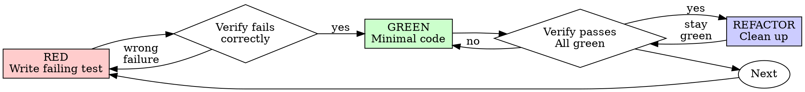

# Test-Driven Development (TDD)

## Overview

For a bug or changed behavior with a practical automated test, capture the failing behavior before fixing and verify it afterward. Test observable behavior and material risks rather than every helper.

Follow explicit user TDD requirements and repository-required checks. For configuration, generated output, a small prose edit, or UI work, choose the smallest relevant check when no such requirement applies. An exception to this workflow does not itself require permission.

## Existing Implementation

Preserve implementation that already exists, including user work. If regression evidence is missing, test against a safe isolated baseline when practical, or use recorded evidence that already demonstrates the failure. Never delete work to enforce a test-order convention.

A test passing immediately can cover existing behavior or a fix already in place. Check that its assertion would distinguish the reported failure; do not restart solely because of the order in which code and tests were written.

## Red-Green-Refactor



### RED - Write Failing Test

Write one minimal test showing what should happen.

<Good>
```typescript
test('retries failed operations 3 times', async () => {
  let attempts = 0;
  const operation = () => {
    attempts++;
    if (attempts < 3) throw new Error('fail');
    return 'success';
  };

  const result = await retryOperation(operation);

  expect(result).toBe('success');
  expect(attempts).toBe(3);
});
```
Clear name, tests real behavior, one thing
</Good>

<Bad>
```typescript
test('retry works', async () => {
  const mock = jest.fn()
    .mockRejectedValueOnce(new Error())
    .mockRejectedValueOnce(new Error())
    .mockResolvedValueOnce('success');
  await retryOperation(mock);
  expect(mock).toHaveBeenCalledTimes(3);
});
```
Vague name, tests mock not code
</Bad>

**Requirements:**
- One behavior
- Clear name
- Real code (no mocks unless unavoidable)

### Verify RED - Watch It Fail

When using the test-first cycle, run the test and confirm the intended failure before implementing. Reuse a recorded failure on the same relevant baseline.

```bash
npm test path/to/test.test.ts
```

Confirm:
- Test fails (not errors)
- Failure message is expected
- Fails because feature missing (not typos)

**Test passes?** Check whether the behavior already exists or the assertion misses the failure. Use the Existing Implementation guidance when a fix is already present.

**Test errors?** Fix error, re-run until it fails correctly.

### GREEN - Minimal Code

Write simplest code to pass the test.

<Good>
```typescript
async function retryOperation<T>(fn: () => Promise<T>): Promise<T> {
  for (let i = 0; i < 3; i++) {
    try {
      return await fn();
    } catch (e) {
      if (i === 2) throw e;
    }
  }
  throw new Error('unreachable');
}
```
Just enough to pass
</Good>

<Bad>
```typescript
async function retryOperation<T>(
  fn: () => Promise<T>,
  options?: {
    maxRetries?: number;
    backoff?: 'linear' | 'exponential';
    onRetry?: (attempt: number) => void;
  }
): Promise<T> {
  // YAGNI
}
```
Over-engineered
</Bad>

Don't add features, refactor other code, or "improve" beyond the test.

### Verify GREEN - Watch It Pass

**MANDATORY.**

```bash
npm test path/to/test.test.ts
```

Confirm:
- Test passes
- Other tests still pass
- No new errors or warnings caused by the change; account for unrelated baseline failures

**Test fails?** Fix code, not test.

**Other tests fail?** Determine whether the change caused them. Fix regressions and report unrelated baseline failures accurately.

### REFACTOR - Clean Up

After green only:
- Remove duplication
- Improve names
- Extract helpers

Keep tests green. Don't add behavior.

### Repeat

Next failing test for next feature.

## Good Tests

| Quality | Good | Bad |
|---------|------|-----|
| **Minimal** | One thing. "and" in name? Split it. | `test('validates email and domain and whitespace')` |
| **Clear** | Name describes behavior | `test('test1')` |
| **Shows intent** | Demonstrates desired API | Obscures what code should do |

## Why Order Matters

A failing test demonstrates that the test detects the behavior being changed. Starting with the assertion can also clarify the intended API before implementation. Tests that mirror the implementation or only assert mock calls may miss the user's actual failure.

When code was written first, preserve it and establish the same useful evidence against an isolated baseline if needed. Recorded manual or integration reproduction can be relevant evidence for behavior that is expensive to automate. State what the chosen check proves and any material limits.

For guidance on honest assertions, test doubles, and setup, consult [writing-good-tests.md](writing-good-tests.md). Name the production behavior that would make the test fail, exercise real behavior, and keep test utilities out of production classes.

## Example: Bug Fix

**Bug:** Empty email accepted

**RED**
```typescript
test('rejects empty email', async () => {
  const result = await submitForm({ email: '' });
  expect(result.error).toBe('Email required');
});
```

**Verify RED**
```bash
$ npm test
FAIL: expected 'Email required', got undefined
```

**GREEN**
```typescript
function submitForm(data: FormData) {
  if (!data.email?.trim()) {
    return { error: 'Email required' };
  }
  // ...
}
```

**Verify GREEN**
```bash
$ npm test
PASS
```

**REFACTOR**
Extract validation for multiple fields if needed.

## Verification Checklist

Before marking work complete:

- Changed behavior and material error paths have appropriate coverage.
- A regression test distinguishes the original failure when a practical baseline is available.
- Relevant tests and repository-required checks pass, or unresolved failures are clearly reported.
- Tests exercise real behavior; mocks represent necessary boundaries.
- Current evidence supports the completion claim. Reuse it until the code, environment, or claim changes.

Missing evidence calls for a focused check or an honest limitation, not deletion of the implementation.

## When Stuck

| Problem | Solution |
|---------|----------|
| Don't know how to test | Write wished-for API. Write assertion first. Ask your human partner. |
| Test too complicated | Design too complicated. Simplify interface. |
| Must mock everything | Code too coupled. Use dependency injection. |
| Test setup huge | Extract helpers. Still complex? Simplify design. |

## Debugging Integration

For a bug with a practical automated reproduction, add a regression test and verify the fix. Otherwise reproduce and verify on the relevant surface, recording enough evidence to support the claim without building a brittle harness solely to satisfy this workflow.

## Completion

Report the behavior changed, the verification performed, and any remaining gap. Do not claim a test-first process when the test was written later; describe the actual regression evidence instead.
